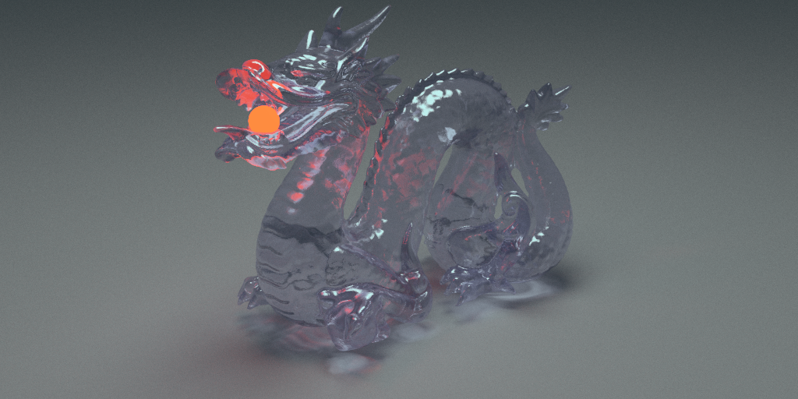
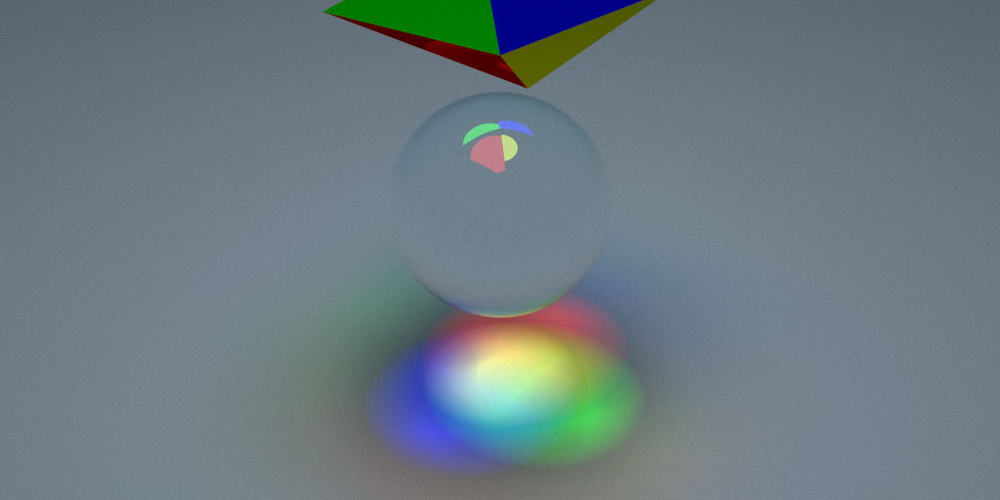
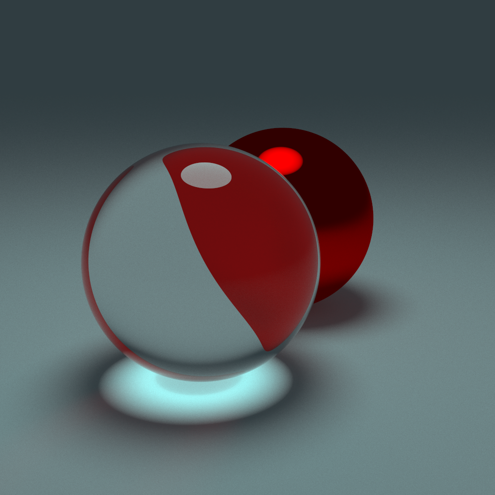

# Oxy 2

Transmissive Stanford Dragon, 8192 samples, 871k triangles, 21 minute render on 24 threads

## Features:

* SDL (Scene description language) for defining scenes
* Shitty rectilinear camera model with a tent filter
* Crappy naive pathtracing with russian roulette pruning
* Materials
  * General purpose BSDF'ish thing which isnt even done yet
  * Emissive with output energy
* Textures
  * Images
  * Solid color
* SDF (Signed distance field) rendering
  * No way of defining these through the SDL right now

## To-do:

* Subsurface scattering
* Environment spheres
  * HDRi textures
  * Atmospheric scattering models
* Mesh instancing
* AVX/SSE for triangle BVH
* Lens model for the camera
* Generative textures
* Extended SDL

## More renders

Different colored lights mixing through a sphere

Glass and a glossy red sphere, light source up top and some ambient lighting
