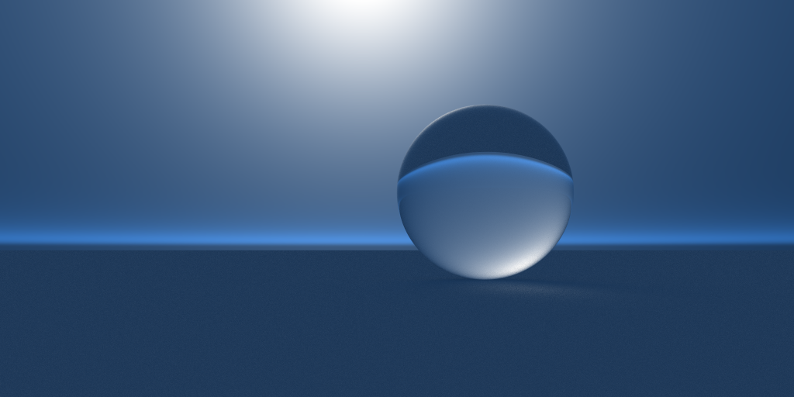

# Oxy 2

Standford Dragon rendered with the PSSMLT integrator

## In progress:
* XSDL
  * Basically want this to be a functional scripting language
  * Also wanna write a JIT x86 compiler so I can define SDF's in a file with no real overhead
* Environment maps

## Features:

* AVX2 / BVH accelerator for meshes
* SDL (Scene description language) for defining scenes
* PSSMLT (Primary sample space Metropolis light transport)
  * No idea if i'm doing it properly, but caustics converge in way fewer samples
* Naive/implicit integrator
  * Converges direct light very fast, but caustics look like ass
* Naive integrator
* General purpose BSDF material
* Textures
  * Images / solid color
* SDF (Signed distance field) rendering
  * No way of defining these through the SDL right now

## To-do:

(This is more of an idea list currently)

* Bidirectional integrator (BDPT)
  * Also want to try combining BDPT with PSSMLT, seems quite simple
* Distributed rendering over the network
* Better surface normal calculation
* Smooth hitnormals for meshes
* Subsurface scattering
* Environment spheres
  * HDRi textures
  * Atmospheric scattering models
* Mesh instancing
* Lens model for the camera
* Generative textures
* Extended SDL (XSDL)
* Various texture maps, like normals, reflectance etc.
* Spectral rendering

## More renders

Blender Suzanne in a ring

Monke in a red and blue cornell box with a glossy wall

Nishita sky model

Different colored lights mixing through a sphere

Glass and a glossy red sphere, light source up top and some ambient lighting
